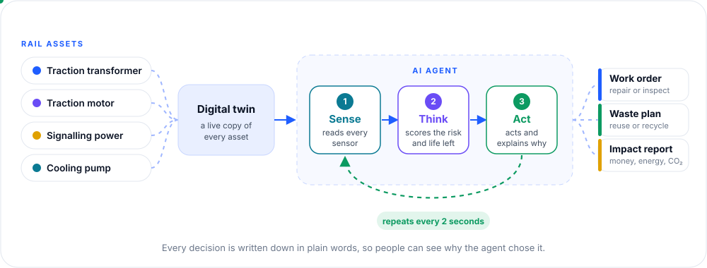
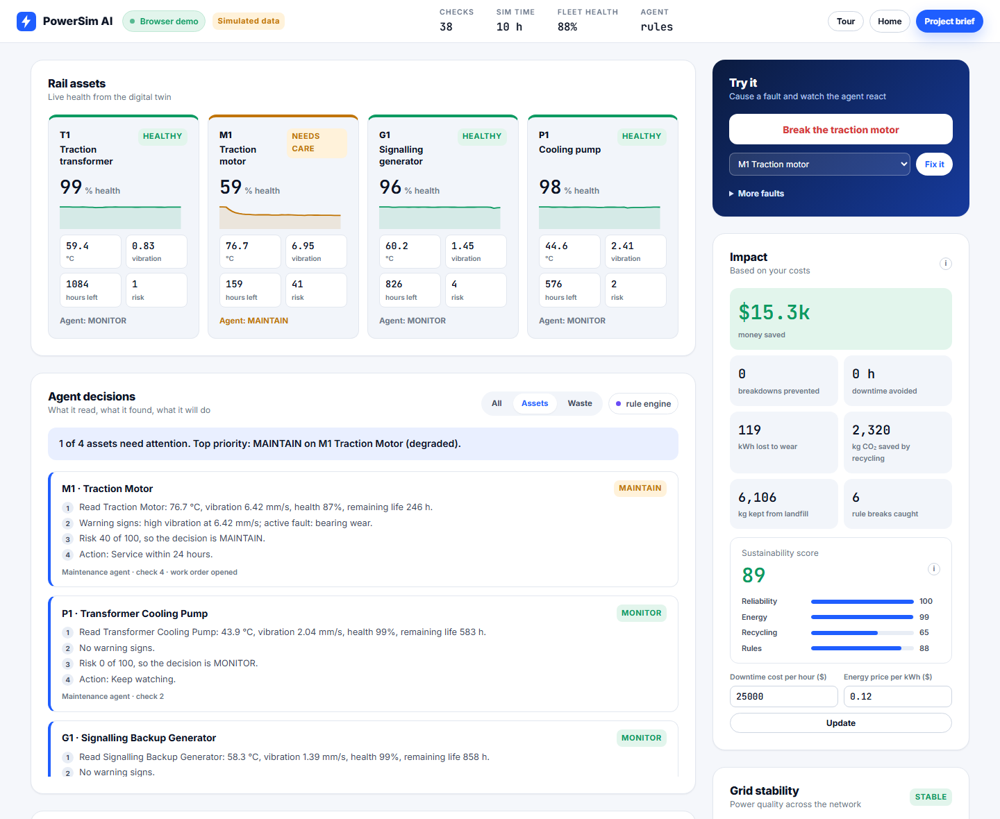

<p align="center">
  <a href="https://powersim-ai.vercel.app"></a>
</p>

<p align="center">
  <a href="https://powersim-ai.vercel.app"></a>
  <a href="https://github.com/yehiasamir27/powersim-ai/actions/workflows/ci.yml"></a>
  
  
  <a href="LICENSE"></a>
</p>

<p align="center">
  <b>Finds problems early. Explains every decision. Cuts waste and saves energy.</b>
</p>

---

## What it is

PowerSim AI is a **digital twin** plus an **AI agent** for railway power equipment.
It watches each asset, spots trouble before a breakdown, and says why in plain words.

- **Predict failures**: health score and remaining life for every asset.
- **Explain decisions**: every action comes with its reasons, not a black box.
- **Cut waste**: sorts waste, checks the rules, suggests reuse or recycling.
- **Show the impact**: downtime avoided, energy lost, CO₂ and money saved.

## How the agent works

<p align="center">
  
</p>

1. **Sense**: reads temperature, vibration, oil and power quality from every asset.
2. **Think**: scores the risk and estimates how long each part will last.
3. **Act**: opens a work order or a waste plan, and writes down why.

It repeats every 2 seconds.

## See it live

**[powersim-ai.vercel.app](https://powersim-ai.vercel.app)** · no sign up, runs in your browser.

Open the dashboard, press **Break the traction motor**, and watch the agent react.

<p align="center">
  
</p>

## Backed by research

Built on an AASTMT study (2026) of **120 professionals** in Egypt's energy, manufacturing and
logistics sectors.

| Finding | Result |
|---|---|
| AI adoption predicts **energy efficiency** | β = 0.761, R² = 0.579, p < 0.05 |
| AI adoption predicts **sustainability** | β = 0.636, R² = 0.404, p < 0.05 |
| Survey reliability | Cronbach's α 0.868 to 0.925 |

## Tech stack

| Layer | Tools |
|---|---|
| Backend | Python, FastAPI, WebSocket, Pydantic |
| AI | Rule engine with explained steps, optional local LLM via Ollama |
| Simulation | Physics based digital twin in Python, mirrored in JavaScript for the public demo |
| Quality | 91 pytest tests, ruff, mypy, GitHub Actions CI |
| Deploy | Docker Compose (full stack), Vercel (public demo) |

## Run it yourself

**With Docker** (app plus local LLM):

```bash
docker compose up --build
```

**With Python:**

```bash
pip install -r requirements.txt
uvicorn main:app --reload
```

Then open **http://localhost:8000**.

<details>
<summary><b>Project layout</b></summary>

```
main.py                FastAPI app: REST, WebSocket, pages
simulation_service.py  Core loop: twin, agents, impact
simulator/             Digital twin, waste engine, maintenance, impact
ai_agent/              Maintenance agent and waste agent
integrations/          Data source interfaces (OPC UA, MQTT and more, planned)
static/                Website, dashboard, project brief, browser engine
tests/                 91 automated tests
docs/                  Research, technical overview, deployment
```

</details>

<details>
<summary><b>Run the tests</b></summary>

```bash
pip install -r requirements-dev.txt
pytest
ruff check .
mypy config.py logging_config.py schemas.py simulation_service.py main.py simulator/ ai_agent/ integrations/
```

</details>

## Learn more

- [Technical overview](docs/TECHNICAL_OVERVIEW.md): architecture, what is simulated, path to real data
- [Deployment](docs/DEPLOYMENT.md): Docker stack and the Vercel demo
- [Market research](docs/MARKET_RESEARCH.md): sources and industry context
- [Project brief](https://powersim-ai.vercel.app/pitch): one page summary, saves as PDF

## Team

| | |
|---|---|
| **Yehia Samir** | Computer Engineering, AASTMT Alexandria (2025). Built the software. |
| **Khaled Mohamed** | Oil and Gas Supply Chain Management Engineering, AASTMT. Led the research. |

---

<sub>All demo data is simulated. Real world testing on live assets is the next step.
MIT License © 2026 Yehia Samir and Khaled Mohamed.</sub>
