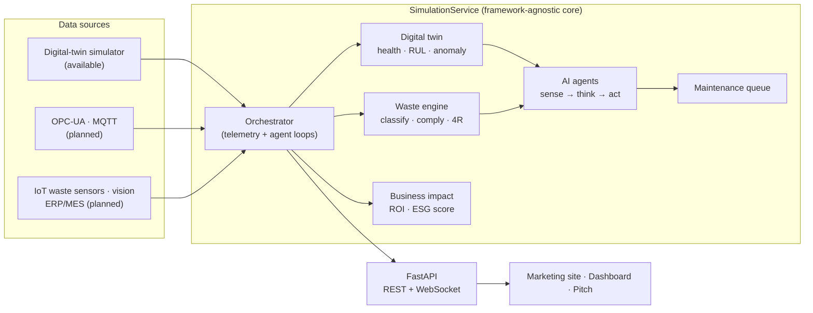

<div align="center">

# ⚡ PowerSim AI

### The autonomous reliability engineer for industrial power.

An **agentic digital twin** that continuously **senses** asset telemetry, **reasons** about failure risk, and **acts** — generating maintenance work orders *before* equipment fails, with an explainable "why" behind every call and ROI computed against your own numbers.

[](https://github.com/yehiasamir27/powersim-ai/actions/workflows/ci.yml)
[](https://www.python.org/)
[](LICENSE)
[](https://github.com/astral-sh/ruff)

**🔗 Live demo: _not yet deployed_** — run `python scripts/build_static.py && vercel deploy --prod` and paste the printed `*.vercel.app` URL here. See [deployment guide](docs/DEPLOYMENT.md).

[Quickstart](#-quickstart-under-2-minutes) · [Market research](docs/MARKET_RESEARCH.md) · [Pitch](docs/PITCH.md) · [Technical overview](docs/TECHNICAL_OVERVIEW.md) · [Deployment](docs/DEPLOYMENT.md)

</div>

> [!IMPORTANT]
> **All metrics in this project are simulated projections** produced by a physics-based
> demonstration model. No real-world validation is implied — validation on customer
> assets is the stated next milestone. Market figures are third-party context, cited in
> [`docs/MARKET_RESEARCH.md`](docs/MARKET_RESEARCH.md).

---

## Why this exists

Industrial plants bleed value to **unplanned downtime**, the **reliability experts** who prevent it are retiring (~1.9M US manufacturing jobs may go unfilled by 2033, per Deloitte), and legacy monitoring cries wolf so often that operators stop listening. Most predictive-maintenance programs stall in "pilot purgatory" — the blocker is **integration and trust, not algorithms**.

Meanwhile the money has arrived and it's **agentic**: Schneider Electric acquired Cognite for **$3.1B (2026)** to make AI *execute* operations, and Gartner forecasts **$53B** of agentic-AI supply-chain software by 2030. PowerSim AI is built for exactly that shift — an agent that closes the loop and shows its work. (See [market research](docs/MARKET_RESEARCH.md) for cited sources.)

## What it does

```
   SENSE                    THINK                       ACT
┌───────────┐         ┌────────────────┐         ┌────────────────┐
│ Digital   │  ─────▶ │ AI agent       │  ─────▶ │ Work orders     │
│ twin      │         │ (LLM or rules) │         │ + business ROI  │
│ health·RUL│         │ explainable    │         │ + ESG impact    │
└───────────┘         └────────────────┘         └────────────────┘
```

- **Sense** — a physics-based digital twin of four assets (transformer, motor, generator, pump). Sensor fusion estimates each asset's health from temperature, vibration, bearing wear, oil pressure and power factor, plus an **anomaly score** and **estimated remaining useful life (RUL)**.
- **Think** — an agent weighs the evidence and produces a decision with a transparent **reasoning trail**. It uses a local LLM (via Ollama) when available and a deterministic rule engine otherwise — and **never degrades silently** (the active mode is always reported).
- **Act** — actionable decisions become prioritized work orders, and every prevented failure is translated into downtime avoided, energy saved, cost and CO₂ — against **your** economics, which you plug in live.

### Two pillars, one agent

The same reasoning engine runs a second pillar: **AI-driven industrial waste management**. Degrading equipment doesn't only risk downtime — it produces more scrap, more contamination and more regulatory exposure, so both are modelled together.

| Layer | What it does |
|---|---|
| **1 · Collect** | Per-source waste telemetry: weight, volume, composition, contamination, moisture — generated from process load *and upstream asset health*. |
| **2 · Process** | Rule-based classification (recyclable / hazardous / general / reusable by-product) + statistical anomaly detection (volume spike, composition drift). |
| **3 · Decide** | A fully-implemented **expert-system compliance rule base** and a **4R recommender** (reduce / reuse / recycle / recover), each with a visible why-trail. |
| **4 · Report** | Diversion, disposal cost avoided, compliance incidents caught and CO₂e — into the same business-impact model, plus a rolled-up sustainability score. |

> The waste classifier is **rule-based, not a trained ML model** — it stands in for the CNN visual sorting and RF/XGBoost ensembles a production deployment would run on real camera/sensor data. See [`docs/TECHNICAL_OVERVIEW.md`](docs/TECHNICAL_OVERVIEW.md) for the full production upgrade path.

## Research foundation

PowerSim AI operationalizes empirically-validated research rather than narrative. Its design is grounded in **"Artificial Intelligence Adoption Intention in Egypt: Effects on Energy Efficiency and Environmental Sustainability"** (Khaled Mohamed, AASTMT, June 2026) — a quantitative survey of **120 professionals** across Egypt's energy, manufacturing and logistics sectors, analysed in SPSS, alongside a literature review covering AI in smart grids, predictive maintenance, renewable-energy forecasting, industrial waste management and Egypt-specific renewable adoption.

| Hypothesis | Result |
|---|---|
| **H1** — AI adoption → energy efficiency | **Supported.** β = 0.761, R² = 0.579, p < 0.05 |
| **H2** — AI adoption → environmental sustainability | **Supported.** β = 0.636, R² = 0.404, p < 0.05 |
| Scale reliability | Cronbach's Alpha **0.868–0.925** across both scales |

The waste pillar's four-layer architecture and its expert-system compliance layer derive directly from that review. *The study establishes adoption-intention relationships among surveyed professionals; it does not measure PowerSim AI's own field performance.*

## Architecture



The digital twin is just **one implementation** of a `TelemetrySource` interface — swapping it for a real OPC-UA / MQTT connector is a connector, not a rewrite. See [`docs/TECHNICAL_OVERVIEW.md`](docs/TECHNICAL_OVERVIEW.md).

## 🚀 Quickstart (under 2 minutes)

### Option A — Docker (full stack: app + Ollama)

```bash
docker compose up --build
```

Open **http://localhost:8000**. The app is fully functional immediately using the deterministic rule engine. To enable LLM narrative reasoning, pull a model once:

```bash
docker compose exec ollama ollama pull qwen2.5:7b
```

### Option B — Local Python

```bash
pip install -r requirements.txt
uvicorn main:app --reload
```

Open **http://localhost:8000**. Ollama is optional — without it, the agent uses rule-based reasoning (and says so). To try the LLM path, [install Ollama](https://ollama.com) and `ollama pull qwen2.5:7b`.

Then: open the **dashboard**, inject a fault, and watch the agent detect it, explain its reasoning, and open a work order — live.

## Features

- ⚙️ **Coherent digital-twin physics** — one latent-health ground truth; sensors generated from it; health estimated back via sensor fusion (an honest "the twin knows, the model infers" pipeline). RUL + anomaly score per asset.
- 🧠 **Continuous agentic loop** — every asset evaluated each cycle; decisions streamed live with a reasoning trail.
- 🔎 **Explainable by default** — a "why" behind every recommendation; honest LLM-vs-rules status (never a silent fallback).
- 💰 **Buyer-supplied ROI** — business-impact model with editable economics and visible methodology; nothing hard-coded.
- ♻️ **Waste & compliance pillar** — classification, anomaly detection, an expert-system compliance rule base and 4R routing, feeding diversion/cost/CO₂e into the same impact model.
- 📊 **Sustainability scorecard** — reliability, energy, diversion and compliance rolled into one auditable score with visible weights.
- 🔌 **Deployment-aware** — `TelemetrySource` / `WasteEventSource` interfaces + OPC-UA, MQTT, historian, IoT-sensor, conveyor-vision, ERP/MES and ISO 50001 roadmap stubs with UI indicators.
- 🎛️ **Premium UI** — original design system, live dashboard with guided tour, animated marketing site, investor pitch page.
- ✅ **Engineering credibility** — 91 tests, ruff + mypy, GitHub Actions CI, one-command Docker.

## API

Interactive docs at **`/docs`** (Swagger UI) when running. Key endpoints:

| Method | Endpoint | Description |
|---|---|---|
| `GET` | `/` · `/dashboard` · `/pitch` | Marketing site · live dashboard · investor summary |
| `GET` | `/health` | Liveness probe |
| `GET` | `/api/state` | Current fleet state, telemetry, queue, impact |
| `GET` | `/api/analysis` | Latest agent decisions + reasoning feed |
| `GET` | `/api/impact` | Business-impact snapshot + methodology |
| `GET` | `/api/waste` | Waste summary + recent classified/compliance-checked consignments |
| `POST` | `/api/impact/assumptions` | Update ROI economics (buyer-supplied) |
| `GET` | `/api/integrations` | Integration catalog (available/planned) |
| `GET` | `/api/agent/status` | Honest agent/LLM status |
| `POST` | `/api/inject-failure` | Inject a developing fault (demo control) |
| `POST` | `/api/maintenance` | Perform maintenance on an asset |
| `POST` | `/api/reset` | Reset the simulation |
| `POST` | `/api/contact` | Demo-request submission |
| `WS` | `/ws/live` | Real-time telemetry + agent frames |

## Configuration

All configuration is environment-driven — no hard-coded hosts, ports, or model names. Copy [`.env.example`](.env.example) to `.env` and adjust. Highlights:

| Variable | Default | Purpose |
|---|---|---|
| `POWERSIM_PORT` | `8000` | HTTP port |
| `POWERSIM_SIMULATION_TICK_SECONDS` | `2.0` | Seconds per simulation tick |
| `POWERSIM_OLLAMA_ENABLED` | `true` | Toggle LLM reasoning |
| `OLLAMA_URL` / `OLLAMA_MODEL` | `localhost:11434` / `qwen2.5:7b` | LLM connection |
| `POWERSIM_LOG_JSON` | `false` | Structured JSON logs (prod) |
| `POWERSIM_IMPACT_*` | — | Default ROI economics |

## Development

```bash
pip install -r requirements-dev.txt

pytest                 # 91 tests
ruff check .           # lint
ruff format --check .  # format
mypy config.py logging_config.py schemas.py simulation_service.py main.py simulator/ ai_agent/ integrations/
```

CI runs all of the above on every push/PR across Python 3.11 and 3.12.

## Project structure

```
config.py               Env-driven settings (pydantic-settings)
logging_config.py       Structured logging
schemas.py              Pydantic request models
simulation_service.py   Framework-agnostic application core
main.py                 FastAPI transport (REST + WebSocket + static)
simulator/              Digital twin, maintenance queue, business impact
ai_agent/               Sense → think → act agent
integrations/           TelemetrySource contract + connector stubs
static/                 Marketing site, dashboard, pitch, design system
tests/                  Pytest suite
docs/                   Market research, pitch, technical overview
```

## Roadmap

- **Now (shipped):** digital twin, continuous agent, explainable trail, business-impact model, tests + CI + Docker.
- **Next:** OPC-UA and MQTT/Sparkplug B connectors; 2–3 design-partner pilots on real assets.
- **Later:** ISO 50001 / EU EED energy reporting, IEC 62443-aligned on-prem/edge, learned RUL with uncertainty, Arabic UI & MENA data residency.

## Business case (conservative, illustrative)

Using the demo's default assumptions ($25k/hr downtime, $0.12/kWh, 0.45 kg CO₂e/kWh), a single **predictive catch** on a degraded asset avoids ~6h of unplanned downtime ≈ **$150k value protected** — a figure the product computes transparently against *your* inputs. These are **simulated projections**; the honest pitch is the working, explainable loop and the deployment-ready architecture — not a headline ROI number.

## Deployment

Two modes, both documented in [`docs/DEPLOYMENT.md`](docs/DEPLOYMENT.md):

- **Production / on-prem** — the full Python · FastAPI · WebSocket · Ollama · Docker stack (`docker compose up --build`). This is the product.
- **Public demo** — a static bundle where the *same pages* run the simulation client-side via `static/assets/sim-engine.js`, because Vercel's serverless model has no always-on process and caps WebSockets at the function duration. Build with `python scripts/build_static.py`, deploy with `vercel deploy --prod`.

## Team

Two engineers from the **Arab Academy for Science, Technology and Maritime Transport (AASTMT)** — combining technical build capability with empirical energy-sector research grounding, from the same institution and rooted in the Egyptian industrial market we target first.

- **Yehia Samir** — Computer Engineering, AASTMT Alexandria (2025). Builder of PowerSim AI: the digital-twin physics, the agentic reasoning loop, the waste-classification pipeline, and the full-stack live demo.
- **Khaled Mohamed** — Oil & Gas Supply Chain Management Engineering, AASTMT College of International Transport & Logistics. Author of the empirical study underpinning the product thesis and architect of the AI waste-management pipeline.

## License

[MIT](LICENSE) © 2026 Yehia Samir & Khaled Mohamed
